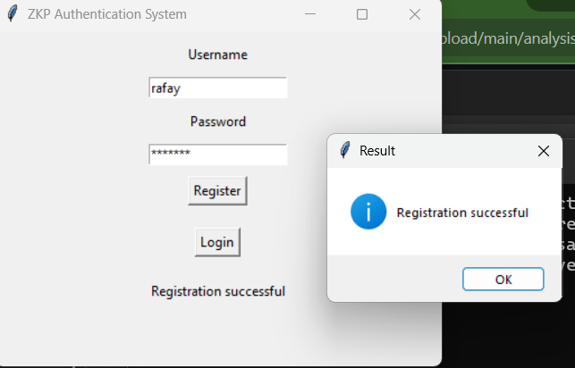
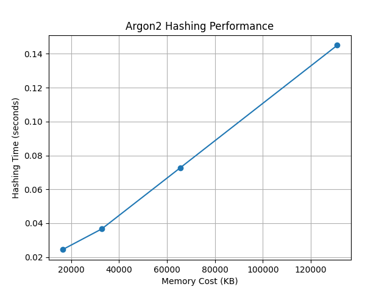

# Zero-Knowledge Proof Authentication System

## Overview
This project implements a secure client-server authentication system using **Zero-Knowledge Proofs (ZKP)** based on the Schnorr protocol. It features a `tkinter` GUI for user interaction, TLS encryption for secure communication, and Argon2 for memory-hard password hashing. The system is designed to resist brute-force, man-in-the-middle, and replay attacks, making it suitable for secure authentication applications.

## Features
- **Secure Registration**: Users can register with a username and password, generating a salt and verifier stored in a SQLite database.
- **Zero-Knowledge Authentication**: Implements Schnorr ZKP for passwordless authentication (1024-bit parameters).
- **TLS Encryption**: Uses self-signed certificates for secure client-server communication.
- **GUI Interface**: Built with `tkinter` for user-friendly registration and login.
- **CLI Client**: Includes a command-line client for testing registration and login.
- **Performance Analysis**: Includes a matplotlib graph analyzing Argon2 hashing performance (time vs. memory cost).
- **Concurrent Clients**: Supports multiple simultaneous clients via threading.
- **Status**: Registration fully functional; login under active development (ZKP verification in progress).

## Folder Structure
```
zkp-auth-system/
├── src/
│   ├── generate_certs.py     # Generates TLS certificates
│   ├── server.py             # Server with ZKP and SQLite
│   ├── client_gui.py         # Tkinter GUI client
│   └── client.py             # CLI client
├── analysis/
│   ├── performance_analysis.py
│   ├── argon2_performance.png
│   └── registration_screenshot.png
├── requirements.txt
├── README.md
└── .gitignore
```

## Setup Instructions
1. **Install Dependencies**:
   ```bash
   cd zkp-auth-system
   pip install -r requirements.txt
   ```
2. **Generate Certificates** (if missing):
   ```bash
   cd src
   python generate_certs.py
   move server.crt server.key ..\certs
   ```
3. **Run the Server**:
   ```bash
   cd src
   python server.py
   ```
4. **Run the GUI Client**:
   ```bash
   cd src
   python client_gui.py
   ```
5. **Run the CLI Client**:
   ```bash
   cd src
   python client.py
   ```
6. **Usage**:
   - GUI: Enter username/password, click “Register” to create a user (stores in `users.db`).
   - CLI: Run `client.py`, select “register” or “login”, enter username/password.
   - Note: Login functionality is under development.

## Demo
Below is a screenshot of successful registration:



## Performance Analysis
The `analysis/performance_analysis.py` script generates a graph (`argon2_performance.png`) showing Argon2 hashing time vs. memory cost, highlighting the memory-hard security of the hashing algorithm.



## Security Features
- **Argon2 Hashing**: Uses memory-hard hashing to resist GPU-based attacks.
- **Schnorr ZKP**: Ensures passwordless authentication without transmitting sensitive data.
- **TLS**: Encrypts all client-server communication.
- **SQLite**: Stores user data securely with unique salts and verifiers.

## .gitignore
The `.gitignore` file excludes:
- `users.db`: SQLite database with user data.
- `certs/*`: TLS certificates.
- `__pycache__/`, `*.pyc`: Python bytecode files.
